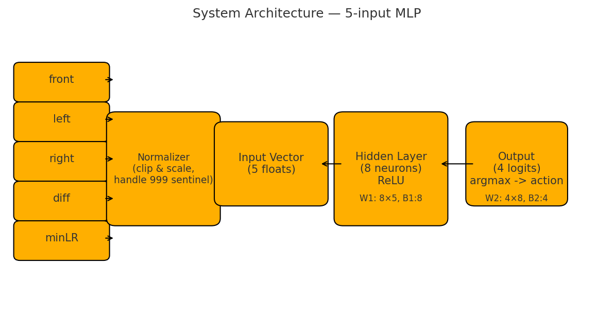
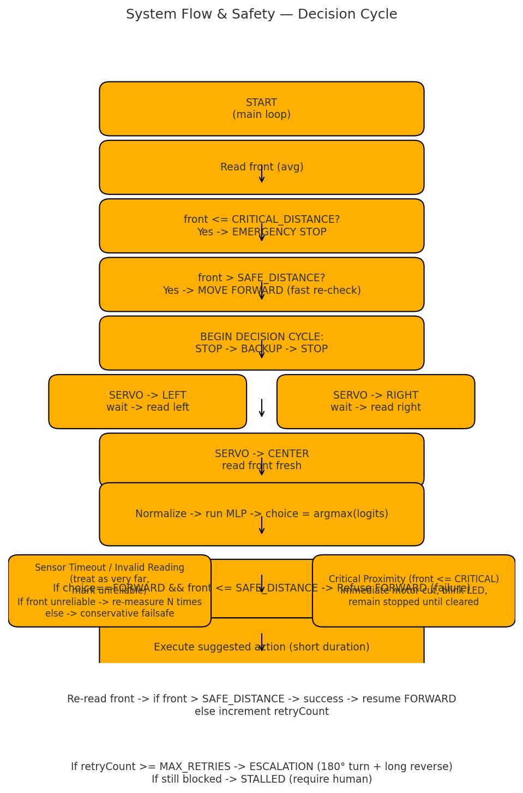

# 🤖 ANNie: Obstacle-Avoiding Robot with Artificial Neural Network

ANNie is a college project that demonstrates **obstacle avoidance** on a small mobile robot using an **Artificial Neural Network (ANN)** for decision-making.  
Instead of relying only on fixed rules, ANNie uses a trained multilayer perceptron to decide between **FORWARD, LEFT, RIGHT, STOP** based on real-time sensor inputs.

---

## 🛠️ Hardware

- **Arduino Uno** (controller)  
- **L298N motor driver** (H-Bridge for 2 DC motors)  
- **4× DC motors with wheels**  
- **HC-SR04 ultrasonic sensor** (mounted on servo)  
- **SG90 micro servo** (rotates sensor left/center/right)  
- **LED indicators** (front/back states)  
- **chassis with battery pack**

---

## 🧠 ANN System Architecture

- **Inputs (5 floats):**  
  `front`, `left`, `right`, `diff (left - right)`, `minLR (min(left,right))`  
- **Hidden Layer:** 64 neurons, ReLU activation  
- **Output Layer:** 4 logits → `FORWARD, LEFT, RIGHT, STOP`  
- **Decision:** argmax selects action, validated with safety checks

---

## 🔄 System Flow

- Fast loop: if path clear, drive forward  
- If obstacle: stop → reverse → scan with servo (left, right, center)  
- Normalize inputs → run ANN → choose action  
- Safety overrides intercept unsafe actions (e.g., FORWARD into obstacle)  
- Retry loop with escalation (backup, 180° turn) if blocked repeatedly

---

## 📊 Dataset

- **Synthetic dataset:** Generated with `generate_synthetic.cpp` for quick testing.  
- **Real dataset:** Adapted from Ziya’s Dynamic Indoor Robot Navigation dataset (`adapt-annie.py` converts into ANNie format).  
- Data columns used:  
front,left,right,diff,minLR,action

---

## 🎓 Training & Simulation

1. Generate Dataset
cl /EHsc /std:c++17 training\generate_synthetic.cpp /Fe:training\gen_data.exe
training\gen_data.exe

2. Train Ann
cl /EHsc /std:c++17 training\train_ann.cpp /I vendor\tiny-dnn /Fe:training\train_ann.exe
training\train_ann.exe

This outputs:

models/ann_model_tinydnn.bin
models/arduino_weights.h

3. Simulate ANN decisions
cl /EHsc /std:c++17 training\simulate_ann.cpp /I vendor\tiny-dnn /Fe:training\simulate_ann.exe
training\simulate_ann.exe

⚡ Firmware

firmware/robot_ann.ino
Loads arduino_weights.h and runs the ANN forward pass in real-time.
Wraps predictions in safety logic: emergency stop, retry count, escalation, sensor timeout handling.

🖼️ Docs

System architecture and flow diagrams are under docs/

Add photos of robot build (hardware_wiring.png)

Videos showing ANNie avoiding obstacles

🚨 Error & Safety Handling

Sensor timeout → treat as far, retry N times, fallback if persistent

Critical proximity → instant motor cut, blink LEDs, wait until clear

Unsafe ANN decision → override, try fallback

Repeated failures → escalate with 180° turn + long reverse

If still blocked → stall mode (stop + heartbeat LED + require human reset)

📈 Performance

Synthetic dataset accuracy: ~26% (toy example)

Real-world dataset accuracy: ~64%

With larger datasets and tuning (epochs, hidden neurons), performance should improve.

Important: safety logic always overrides ANN — so even imperfect ANN predictions won’t cause collisions.

🙌 Credits

tiny-dnn
 (header-only neural net lib)

Ziya’s Dynamic Indoor Robot Navigation Dataset

Arduino + robotics community tutorials for base movement logic